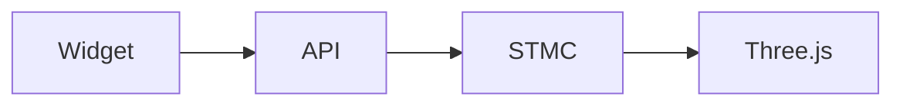
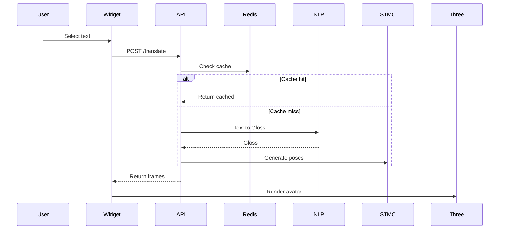

# SignFlow 🦋

**Motion Continuity for Natural Sign Language Avatars**

> "The future of sign language is fluid, connected, and beautiful."

---

## Why SignFlow?

Traditional sign language avatars often feel **"stiff"** because they treat signs as individual blocks—choppy, robotic, and hard for native signers to understand.

**SignFlow solves this with Motion Continuity (STMC):**

- Focuses on the **transitions between signs** — the "connective tissue" of movement
- Creates fluid, natural motion that mirrors how native signers actually communicate
- Significantly easier for deaf and hard-of-hearing users to understand

---

## The Problem

```
Traditional Avatar Motion:

[HELLO] → [HOW] → [ARE] → [YOU]
  ⬇️       ⬇️       ⬇️      ⬇️
 Block    Block    Block   Block
   ↓        ↓        ↓       ↓
 Choppy   Choppy   Choppy  Choppy
```

Each sign is treated as a separate, disconnected animation. The result feels robotic and loses the natural flow of sign language.

---

## The SignFlow Solution

```
SignFlow Motion Continuity:

[HELLO] ═══ [HOW] ═══ [ARE] ═══ [YOU]
  ⬇️         ⬇️         ⬇️        ⬇️
 Transition  Transition Transition
   ↓           ↓          ↓         ↓
  Fluid      Fluid      Fluid     Fluid
```

**STMC (Sign Transition Motion Continuity)** analyzes the space between signs and generates smooth, natural transitions that mirror human signing patterns.

---

## Architecture - The 3 Pillars



### 1. The Web Widget (Frontend)
- **Framework:** Vanilla JS + Three.js
- **Purpose:** Embeddable web component that captures text, renders 3D avatar
- **Output:** WebGL animation rendered in browser

### 2. The Translation API (Backend)
- **Framework:** Python FastAPI
- **Purpose:** Bridge between widget and ML engine
- **Features:** Redis caching for instant responses

### 3. The Inference Engine (ML Core)
- **Framework:** PyTorch
- **Purpose:** Text-to-Gloss + Gloss-to-Pose generation
- **Model:** STMC (Sign Transition Motion Continuity)

---

## Data Flow



---

## API Data Contract

```json
{
  "text": "Hello",
  "fps": 30,
  "frames": [
    {
      "RightArm": [0.1, 0.2, 0.3, 0.9],
      "RightForearm": [0.0, 0.5, 0.0, 0.8],
      "LeftArm": [-0.1, 0.2, -0.3, 0.9],
      "Head": [0.0, 0.0, 0.0, 1.0]
    }
  ]
}
```

---

## Getting Started

```bash
git clone https://github.com/arananet/SignFlow.git
cd SignFlow
docker-compose up
```

---

## Tech Stack

| Component | Technology |
|-----------|------------|
| Widget | Vanilla JS, Three.js, WebGL |
| API | Python, FastAPI, Redis |
| ML | PyTorch, TensorFlow |
| 3D Models | GLTF/GLB, Blender |

---

## License

MIT — SignFlow is open source.

---

**Developer:** Eduardo Arana  
**Assistant:** Soda 🥤
