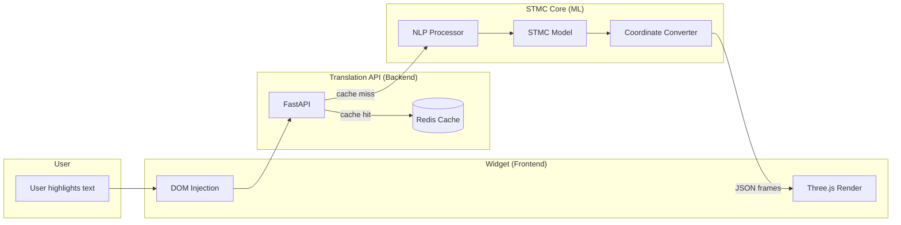

# SignFlow 🦋

**Motion Continuity for Natural Sign Language Avatars**

> "The future of sign language is fluid, connected, and beautiful."

---

## Why SignFlow?

Traditional sign language avatars often feel **"stiff"** because they treat signs as individual blocks—choppy, robotic, and hard for native signers to understand.

**SignFlow solves this with Motion Continuity (STMC):**

- Focuses on the **transitions between signs** — the "connective tissue" of movement
- Creates fluid, natural motion that mirrors how native signers actually communicate
- Significantly easier for deaf and hard-of-hearing users to understand

---

## The Problem

```
Traditional Avatar Motion:

[HELLO] → [HOW] → [ARE] → [YOU]
  ⬇️       ⬇️       ⬇️      ⬇️
 Block    Block    Block   Block
   ↓        ↓        ↓       ↓
 Choppy   Choppy   Choppy  Choppy
```

Each sign is treated as a separate, disconnected animation. The result feels robotic and loses the natural flow of sign language.

---

## The SignFlow Solution

```
SignFlow Motion Continuity:

[HELLO] ═══ [HOW] ═══ [ARE] ═══ [YOU]
  ⬇️         ⬇️         ⬇️        ⬇️
 Transition  Transition Transition
   ↓           ↓          ↓         ↓
  Fluid      Fluid      Fluid     Fluid
```

**STMC (Sign Transition Motion Continuity)** analyzes the space between signs and generates smooth, natural transitions that mirror human signing patterns.

---

## Architecture - The 3 Pillars



### 1. The Web Widget (Frontend)
- **Framework:** Vanilla JS + Three.js
- **Purpose:** Embeddable web component that captures text, renders 3D avatar
- **Output:** WebGL animation rendered in browser

### 2. The Translation API (Backend)
- **Framework:** Python FastAPI
- **Purpose:** Bridge between widget and ML engine
- **Features:** Redis caching for instant responses

### 3. The Inference Engine (ML Core)
- **Framework:** PyTorch
- **Purpose:** Text-to-Gloss + Gloss-to-Pose generation
- **Model:** STMC (Sign Transition Motion Continuity)

---

## Repository Structure

```
SignFlow/
├── widget/                    # Frontend: Embeddable web widget
│   ├── src/
│   │   ├── index.ts          # Entry point
│   │   └── engine/
│   │       └── renderer.ts   # Three.js 3D avatar
│   └── package.json
│
├── api/                       # Backend: FastAPI server
│   ├── main.py                # API endpoints
│   ├── routes/                # API routes
│   └── package.json
│
├── stmc_core/                 # ML: PyTorch models
│   ├── stmc_model.py         # STMC neural network
│   ├── data_processing/       # NLP scripts
│   ├── checkpoints/           # Trained weights
│   └── package.json
│
├── assets/                    # 3D models (.gltf/.glb)
│
├── .spec/                     # Specifications
│   ├── spec-001-core-engine.md
│   ├── spec-002-avatar-renderer.md
│   └── spec-003-stmc-model.md
│
├── docker-compose.yml         # Local development
└── README.md
```

---

## Data Flow

```mermaid
sequenceDiagram
    participant User
    participant Widget
    participant API
    participant Redis
    participant NLP
    participant STMC
    participant Three

    User->>Widget: Highlights text
    Widget->>API: POST /translate {"text": "Hello"}
    
    alt Cache Hit
        API->>Redis: Check cache
        Redis-->>API: Return cached animation
        API-->>Widget: Return frames
    else Cache Miss
        API->>NLP: Text → ASL Gloss
        NLP-->>API: "HELLO"
        API->>STMC: Generate keyframes
        STMC-->>API: Pose data
        API->>Redis: Cache result
        API-->>Widget: Return frames
    end
    
    Widget->>Three: Apply rotations to avatar
    Three-->>User: Render 3D animation
```



---

## API Data Contract

```json
{
  "text": "Hello",
  "fps": 30,
  "frames": [
    {
      "RightArm": [0.1, 0.2, 0.3, 0.9],
      "RightForearm": [0.0, 0.5, 0.0, 0.8],
      "RightHand": [0.0, 0.0, 0.0, 1.0],
      "LeftArm": [-0.1, 0.2, -0.3, 0.9],
      "LeftForearm": [0.0, -0.5, 0.0, 0.8],
      "LeftHand": [0.0, 0.0, 0.0, 1.0],
      "Head": [0.0, 0.0, 0.0, 1.0]
    }
  ]
}
```

---

## Getting Started

### Option 1: Docker Compose (Recommended)

```bash
# Clone and start
git clone https://github.com/arananet/SignFlow.git
cd SignFlow
docker-compose up
```

### Option 2: Manual

```bash
# Backend
cd api
pip install -r requirements.txt
uvicorn main:app --reload

# Widget
cd widget
npm install
npm run dev

# ML Core
cd stmc_core
pip install torch torchvision
python stmc_model.py
```

---

## Tech Stack

| Component | Technology |
|-----------|------------|
| Widget | Vanilla JS, Three.js, WebGL |
| API | Python, FastAPI, Redis |
| ML | PyTorch, TensorFlow |
| 3D Models | GLTF/GLB, Blender |

---

## Specifications

See `.spec/` directory for formal specifications:

| Spec | Title |
|------|-------|
| 001 | SignFlow Core Engine |
| 002 | Avatar Renderer |
| 003 | STMC Transition Model |

---

## Contributing

Contributions welcome! See `CONTRIBUTING.md` for details.

---

## License

MIT License — SignFlow is open source.

---

## Related

- [EdgeNeuro](https://github.com/arananet/edgeneuro) — Neuro-symbolic AI routing
